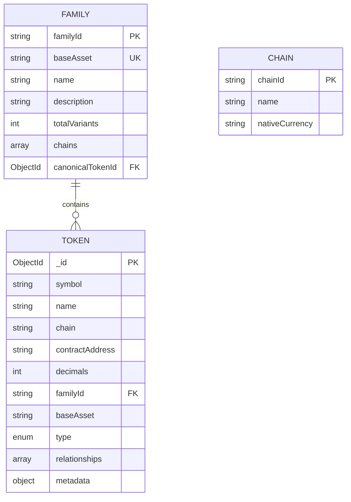

# Token Family Catalog - Architecture Documentation

## Overview

The Token Family Catalog is a Next.js application designed to organize and visualize multi-chain token relationships. It groups tokens into "families" based on their underlying asset (e.g., all ETH variants belong to the ETH family) and tracks relationships across different chains and token types.

## Table of Contents

1. [Data Model](#data-model)
2. [Family Grouping Algorithm](#family-grouping-algorithm)
3. [Relationship Storage and Querying](#relationship-storage-and-querying)
4. [Architecture Tradeoffs](#architecture-tradeoffs)
5. [Handling Ambiguous Cases](#handling-ambiguous-cases)
6. [Future Improvements](#future-improvements)

---

## Data Model

### Entity-Relationship Diagram



### Token Schema

The Token model represents individual token instances across different blockchains.

**Key Fields:**
- `symbol`: Token symbol (e.g., "WETH", "USDC")
- `name`: Full token name
- `chain`: Blockchain identifier (e.g., "ethereum", "arbitrum")
- `contractAddress`: Smart contract address
- `decimals`: Token decimal places
- `familyId`: **Denormalized** hash-based family identifier
- `baseAsset`: Underlying asset (e.g., "ETH", "BTC")
- `type`: Token classification enum

**Token Types:**
- `CANONICAL`: The original/native token (e.g., ETH on Ethereum)
- `WRAPPED`: Wrapped version (e.g., WETH)
- `BRIDGED`: Cross-chain bridged token (e.g., WETH on Arbitrum)
- `DERIVATIVE`: Staking derivatives or yield-bearing tokens (e.g., stETH, rETH)
- `SYNTHETIC`: Synthetic/algorithmic representations

**Metadata Object:**
```typescript
{
  isCanonical: boolean,
  bridgeProtocol?: string,  // e.g., "Arbitrum Bridge", "Circle CCTP"
  wrappingProtocol?: string // e.g., "WETH9", "Lido"
}
```

**Indexes:**
- Compound unique index on `(chain, contractAddress)` - ensures no duplicates
- Index on `familyId` - fast family lookups
- Index on `(familyId, type)` - efficient filtering by family and type
- Individual indexes on `symbol`, `chain`, `baseAsset`, `type`

### Family Schema

The Family model aggregates tokens sharing the same underlying asset.

**Key Fields:**
- `familyId`: SHA-256 hash of `baseAsset` (deterministic, unique)
- `baseAsset`: The underlying asset identifier (unique)
- `canonicalTokenId`: Reference to the "main" token (usually CANONICAL type)
- `name`: Human-readable family name
- `description`: Family description
- `totalVariants`: Count of tokens in this family
- `chains`: Array of chains where family exists

**Indexes:**
- Unique indexes on `familyId` and `baseAsset`

### Chain Schema

Simple reference data for blockchain networks.

**Key Fields:**
- `chainId`: Unique chain identifier
- `name`: Full chain name
- `nativeCurrency`: Native token symbol

---

## Family Grouping Algorithm

### Core Concept

Tokens are grouped into families based on their `baseAsset` field. The `familyId` is deterministically generated using SHA-256 hashing.

### Algorithm Implementation

```typescript
function generateFamilyId(baseAsset: string): string {
  return crypto
    .createHash('sha256')
    .update(baseAsset.toUpperCase())
    .digest('hex');
}
```

**Why SHA-256?**
- **Deterministic**: Same baseAsset always produces same familyId
- **Collision-resistant**: Virtually impossible for different assets to produce same hash
- **Stable**: FamilyId never changes, even across database resets
- **Distributed-friendly**: No need for centralized ID generation

### Family Creation Process

When tokens are ingested via `/api/ingest`:

1. **Token Processing**
   - For each token, compute `familyId = generateFamilyId(baseAsset)`
   - Upsert token with familyId (update if exists, insert if new)

2. **Family Aggregation**
   - Group all processed tokens by their familyId
   - For each family:
     - Query all tokens with that familyId
     - Identify canonical token (where `type === CANONICAL`)
     - Extract unique chains
     - Count total variants
     - Upsert family document

3. **Canonical Token Selection**
   - Priority: `metadata.isCanonical === true`
   - Fallback: `type === TokenType.CANONICAL`
   - If multiple candidates exist, first one is selected

### Example

```
Input: Token with baseAsset="ETH"
Step 1: familyId = sha256("ETH") = "cef1233f..."
Step 2: Assign familyId to token
Step 3: Update/create Family with familyId="cef1233f..."
```

---

## Relationship Storage and Querying

### Current Implementation

Relationships are **implicitly derived** rather than explicitly stored in edges.

**Implicit Relationships:**
- All tokens in a family are related through `familyId`
- Canonical token acts as the "root" node
- Type-based relationships (canonical → wrapped, canonical → bridged)
- Chain-based relationships (same token across different chains)

### Querying Strategy

**1. Find Related Tokens**
```typescript
// Get all tokens in same family
const relatedTokens = await Token.find({
  familyId: token.familyId,
  _id: { $ne: token._id } // Exclude self
});
```

**2. Group by Type**
```typescript
const tokensByType = relatedTokens.reduce((acc, t) => {
  if (!acc[t.type]) acc[t.type] = [];
  acc[t.type].push(t);
  return acc;
}, {});
```

**3. Group by Chain**
```typescript
const tokensByChain = relatedTokens.reduce((acc, t) => {
  if (!acc[t.chain]) acc[t.chain] = [];
  acc[t.chain].push(t);
  return acc;
}, {});
```

### Relationship Schema (Prepared but Unused)

The Token schema includes a `relationships` array for future explicit relationship tracking:

```typescript
interface IRelationship {
  type: RelationType;          // WRAPS, BRIDGES_TO, etc.
  targetTokenId: ObjectId;     // Reference to related token
}
```

**Relationship Types:**
- `WRAPS` / `WRAPPED_BY`: For wrapper relationships
- `BRIDGES_TO` / `BRIDGED_FROM`: For cross-chain bridges
- `DERIVES_FROM` / `DERIVATIVE_OF`: For derivatives

**Why Not Used Currently?**
- Simpler implementation using implicit relationships
- Easier to query and maintain
- Sufficient for current use cases
- Can be added later for complex relationship tracking

---

## Architecture Tradeoffs

### 1. Denormalization: Storing `familyId` in Token

**Decision:** Store `familyId` directly in each Token document

**Pros:**
- Fast family lookups: Single index scan to find all tokens in a family
- No JOIN operations needed (MongoDB doesn't have native joins)
- Query performance scales linearly
- Simplified application logic

**Cons:**
- Data duplication: familyId repeated in every token
- Update complexity: If family rules change, need to update all tokens
- Slight storage overhead

**Verdict:** ✅ Correct tradeoff for read-heavy application

### 2. Hash-Based Family ID Generation

**Decision:** Use SHA-256(baseAsset) instead of auto-increment or UUID

**Pros:**
- **Deterministic**: Same input always produces same ID
- **Idempotent**: Re-running ingest won't create duplicate families
- **Distributed-safe**: No coordination needed across instances
- **Stable**: Family IDs never change

**Cons:**
- Less human-readable than sequential IDs
- Slightly more compute (negligible for modern systems)
- Cannot easily determine order of creation

**Verdict:** ✅ Determinism and stability outweigh readability concerns

### 3. Implicit vs Explicit Relationships

**Decision:** Use implicit relationships through familyId, keep explicit relationship schema for future

**Pros:**
- Simpler data model
- Easier to query (single collection scan)
- Lower maintenance overhead
- Automatically handles new tokens added to family

**Cons:**
- Cannot represent nuanced relationships (e.g., "WETH wraps ETH")
- All relationships have equal weight
- Limited graph traversal capabilities

**Verdict:** ✅ Start simple, add complexity when needed

### 4. Family Metadata Denormalization

**Decision:** Store aggregated data (totalVariants, chains) in Family document

**Pros:**
- Instant access to summary statistics
- No need to count tokens on every request
- Faster API responses

**Cons:**
- Must keep in sync with Token updates
- Potential for stale data if updates fail
- Additional write complexity

**Verdict:** ✅ Read performance justifies sync complexity

---

## Handling Ambiguous Cases

### Case Study: WETH Across Chains

**The Problem:**
WETH exists on multiple chains but represents different things:
- **Ethereum WETH**: Wraps native ETH (type: WRAPPED)
- **Arbitrum WETH**: Bridged Ethereum WETH (type: BRIDGED)
- **Polygon WETH**: Bridged Ethereum WETH (type: BRIDGED)

**Current Solution:**
All WETH variants belong to the ETH family (baseAsset: "ETH") but have different types:

```json
{
  "symbol": "WETH",
  "chain": "ethereum",
  "baseAsset": "ETH",
  "type": "WRAPPED",
  "metadata": {
    "wrappingProtocol": "WETH9"
  }
}
```

```json
{
  "symbol": "WETH",
  "chain": "arbitrum",
  "baseAsset": "ETH",
  "type": "BRIDGED",
  "metadata": {
    "bridgeProtocol": "Arbitrum Bridge"
  }
}
```

**Key Insight:** The `type` field differentiates the use case while keeping them in the same family.

### Other Ambiguous Cases

**1. USDC vs USDC.e**
- Native USDC (Circle CCTP): type = BRIDGED, symbol = "USDC"
- Legacy bridged USDC: type = BRIDGED, symbol = "USDC.e"
- Both in USDC family, differentiated by symbol and metadata

**2. Staking Derivatives**
- stETH, wstETH, cbETH, rETH all derive from ETH
- All belong to ETH family
- Type = DERIVATIVE
- Differentiated by wrappingProtocol in metadata

**3. Wrapped BTC Variants**
- WBTC, tBTC, cbBTC all in BTC family
- All have type = WRAPPED (or DERIVATIVE)
- Differentiated by wrappingProtocol

---

## Cross-Chain Asset Assumptions

### Assumption 1: Base Asset Defines Family
A token's family is determined solely by its underlying asset, not its location or wrapper.

**Implication:** WETH on Arbitrum is part of the ETH family, not a separate family.

### Assumption 2: Canonical Token is Chain-Specific
The "canonical" token is typically the native/original version on its home chain.

**Examples:**
- ETH on Ethereum is canonical
- USDC on Ethereum is canonical (issued by Circle)
- BTC doesn't have an on-chain canonical (all EVM versions are wrapped)

### Assumption 3: Bridge Neutrality
The system doesn't prefer one bridge over another. All bridged versions are treated equally.

**Implication:** USDC bridged via CCTP vs Polygon PoS Bridge are both just "BRIDGED" type.

### Assumption 4: Type Hierarchy
Implicit hierarchy: CANONICAL → WRAPPED → BRIDGED → DERIVATIVE

**Visualization in UI:** Canonical at center, others branching out.

---

## Future Improvements

### 1. Explicit Relationship Edges

**Current State:** Implicit relationships via familyId
**Improvement:** Add explicit directed edges

```typescript
// Example: WETH → ETH wrapping relationship
{
  type: "WRAPS",
  targetTokenId: ethTokenId
}
```

**Benefits:**
- Graph database-style queries
- Relationship-specific metadata
- Multi-hop traversal (e.g., "find all tokens 2 degrees from ETH")

### 2. Temporal Data (Token History)

**Improvement:** Track token metadata changes over time

```typescript
interface TokenSnapshot {
  tokenId: ObjectId;
  timestamp: Date;
  changedFields: object;
}
```

**Use Cases:**
- Audit trail for contract address changes
- Historical TVL for derivatives
- Track bridge migrations (USDC → USDC.e deprecation)

### 3. Liquidity & TVL Integration

**Improvement:** Integrate with DeFi protocols for real-time data

```typescript
interface TokenMetrics {
  tokenId: ObjectId;
  tvl: number;
  liquidityUSD: number;
  holders: number;
  updatedAt: Date;
}
```

**Use Cases:**
- Sort families by TVL
- Identify most-used variants
- Warn about low-liquidity versions

### 4. Automated Token Discovery

**Current State:** Manual seed data
**Improvement:** Automated ingestion via chain indexers

**Approach:**
- Monitor token factories (ERC20 deployments)
- Use ML to classify token type
- Auto-suggest baseAsset based on name/symbol patterns

### 5. Graph Visualization

**Current State:** Simple tree diagram
**Improvement:** Interactive graph using D3.js or Cytoscape.js

**Features:**
- Zoom/pan on large families
- Filter by chain/type
- Highlight relationship paths
- Click to expand token details

### 6. Multi-Language Support (i18n)

**Improvement:** Internationalize token names and descriptions

```typescript
interface LocalizedFamily {
  name: {
    en: "Ethereum Family",
    zh: "以太坊家族",
    es: "Familia Ethereum"
  }
}
```

### 7. API Rate Limiting & Caching

**Current State:** No rate limiting
**Improvement:** Add Redis caching and rate limits

**Benefits:**
- Protect against abuse
- Faster responses for repeated queries
- Reduced database load

### 8. Search & Autocomplete

**Improvement:** Full-text search on token symbols/names

**Tech Stack:**
- MongoDB Atlas Search
- OR Elasticsearch/Algolia integration

**Features:**
- Fuzzy matching ("WBTC" matches "Wrapped BTC")
- Autocomplete dropdown
- Search across chains

### 9. Token Verification System

**Improvement:** Community-verified token metadata

```typescript
interface TokenVerification {
  tokenId: ObjectId;
  verified: boolean;
  verifiedBy: string; // ENS, project team, community
  verificationDate: Date;
}
```

**Purpose:** Reduce scam/fake token visibility

### 10. Analytics Dashboard

**Improvement:** Admin dashboard for system insights

**Metrics:**
- Family growth over time
- Most-queried tokens
- Chain distribution
- Type distribution
- API usage stats

---

## Scalability Considerations

### Current Limits
- **Tokens:** ~50-100K tokens comfortably
- **Families:** ~1K families
- **Concurrent Users:** ~100-500 (single instance)

### Scaling Strategies

**Horizontal Scaling:**
- Next.js supports multi-instance deployment
- MongoDB replica sets for read scaling
- No server-side session state (stateless API)

**Database Optimization:**
- Sharding by `familyId` for massive datasets
- Separate read replicas for analytics
- Archive old token snapshots

**Caching Layers:**
- Redis for hot data (popular families)
- CDN for static assets
- Edge caching for API responses

---

## Conclusion

The Token Family Catalog architecture prioritizes:
1. **Simplicity:** Implicit relationships over complex graphs
2. **Performance:** Denormalization for fast reads
3. **Reliability:** Deterministic IDs and idempotent operations
4. **Extensibility:** Schema supports future enhancements

The system is production-ready for current scale and has clear paths for growth as token ecosystems expand.
